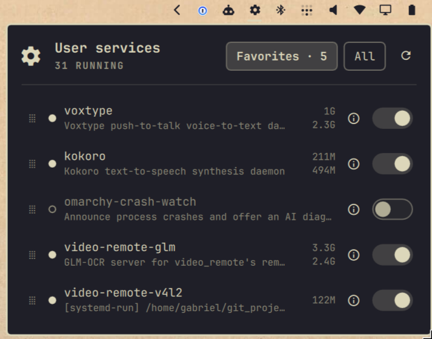

# User Services

**See what your local services really cost, and stop, start or restart them
from the Omarchy bar.**

If you run heavy things as `systemctl --user` services (local AI models,
speech-to-text, OCR or inference servers, GPU jobs), this widget shows the
**actual RAM and VRAM each one holds** right next to its on/off switch. Free a
few gigabytes of VRAM before a game or a training run with one click, then
bring the model back when you're done.



## Features

- **Start/stop switch** on every service, and the bar icon turns urgent when
  one has failed.
- **Real RAM and VRAM per service.** RAM leaves out disk cache (model weights
  read from disk would otherwise double the figure). VRAM works on AMD, Intel
  and NVIDIA with nothing extra to install. Hover the figures for labels.
- **Favorites tab** with the services you care about, in the order you drag
  them into. The **All** tab lists every service with a filter and a star to
  add favorites.
- **Details view** per service: restart, a **Start at login** switch
  (`systemctl --user enable/disable`), status, PID, uptime, RAM, VRAM, CPU time
  and tasks refreshed every 2 seconds, and its **live journal** (newest 300
  lines, capped at 64 KiB), with a button to follow it in a terminal.
- Fully keyboard driven, plus IPC for scripts and keybindings.

## Install

```sh
omarchy plugin add https://github.com/gabepsilva/omarchy-user-services.git --enable
```

The widget is added to the right side of the bar. Move it with
`omarchy bar move io.github.gabepsilva.user-services --section center --index 0`.

## Remove

```sh
omarchy plugin remove io.github.gabepsilva.user-services
```

This removes the widget from the bar and deletes the plugin folder
(`omarchy` keeps a backup). Your favorites live in the widget's own entry in
`~/.config/omarchy/shell.json` and go with it.

## Requirements

Everything below ships with Omarchy; nothing else is installed or downloaded.

- systemd user session: `systemctl`, `journalctl`
- `bash`, `sh`, `awk`, `find`, `grep`
- cgroup v2 at `/sys/fs/cgroup` (the default on Arch/Omarchy) for RAM figures
- VRAM: the kernel's DRM fdinfo for amdgpu, i915/xe, nouveau and other DRM
  drivers; `nvidia-smi` for the proprietary NVIDIA driver. It is part of
  `nvidia-utils`, which every NVIDIA driver install already has. Without it
  NVIDIA VRAM is simply not shown.
- "Follow in terminal" uses Omarchy's `uwsm-app` and `xdg-terminal-exec`.

## Usage

- **Left click** the icon to open the panel, **middle click** to refresh.
- Failed services sort first in the All tab, then running, then stopped.
- Keyboard: `j`/`k` or arrows move, `h`/`l` switch tabs, `Enter`/`Space`
  start/stop, `d` details, `r` restart, `s` favorite, `Shift+J`/`Shift+K`
  reorder favorites, `/` filter, `R` refresh, `Esc` close.
- In the details view: `r` restart, `e` start at login, `f` follow logs in a
  terminal, `j`/`k` scroll logs, `Esc` back.

IPC:

```sh
omarchy-shell io.github.gabepsilva.user-services toggle
omarchy-shell io.github.gabepsilva.user-services start|stop|restart foo.service
omarchy-shell io.github.gabepsilva.user-services details foo.service
omarchy-shell io.github.gabepsilva.user-services favorite foo.service   # toggle
omarchy-shell io.github.gabepsilva.user-services refresh
```

## How memory is measured

- **RAM** (`memory.sh`): `anon + shmem + kernel` from each service's cgroup
  `memory.stat`. Page cache is left out; the kernel drops it whenever something
  else needs the memory, so it isn't memory the service holds. systemd's own
  `MemoryCurrent` includes it, which is why it can show double.
- **VRAM** (`vram.sh`): per-process `drm-total-vram` from
  `/proc/<pid>/fdinfo`, counting each DRM client once, plus
  `nvidia-smi --query-compute-apps` when available (CUDA memory lives outside
  DRM). Processes are mapped to services through their cgroups.

## Settings

Edit through the bar settings, or in the widget's entry in
`~/.config/omarchy/shell.json`.

| Key                  | Default | Meaning                                      |
|----------------------|---------|----------------------------------------------|
| `showInactive`       | `true`  | List stopped services too                    |
| `hideAutostart`      | `true`  | Hide generated `app-*@autostart.service`     |
| `refreshIntervalSec` | `5`     | Poll interval while the popup is open        |
| `favorites`          | `[]`    | Ordered unit names (managed by the panel)    |

## What it runs

Only `systemctl --user` and `journalctl --user-unit` for your own user, the
bundled read-only scripts (`memory.sh`, `vram.sh`, `logs.sh`), and `nvidia-smi`
if present. It never asks for root or elevated privileges and makes no network
connections.
It changes a service only when you click or press a key for it. Stopping
session plumbing such as `dbus-broker` or `pipewire` will break your desktop
session until it's restarted, so leave those alone.

## Development

`Model.js` holds the panel's pure logic; its tests need only Node:

```sh
node --test test/model.test.mjs
```

## License

MIT, see [LICENSE](LICENSE).
